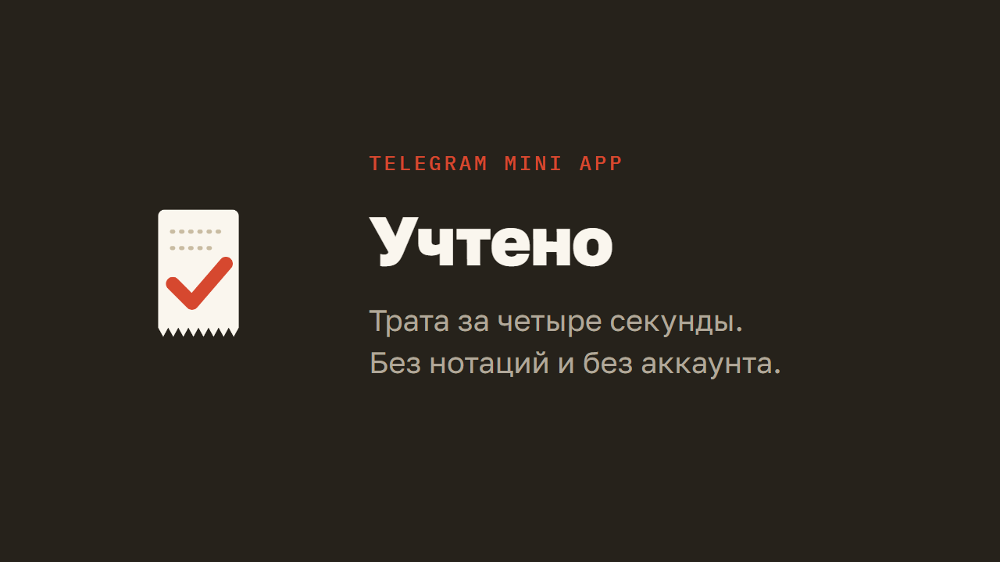

# Учтено

**Учёт трат без чувства вины.** Мини-приложение для Telegram: сумма, категория, штамп — и человек свободен.

[**Открыть в Telegram → @uchteno_bot**](https://t.me/uchteno_bot) · [Разбор проекта в портфолио](https://dyakov-denis.space/case/uchteno)

---

## Зачем

Приложений для учёта трат много, и почти все построены на одном допущении: человек согласен ежедневно работать своим бухгалтером. Счета, валюты, теги, комментарий к каждой покупке — а следом графики, которые молча укоряют. Через неделю такой учёт бросают, и остаётся только чувство вины.

Здесь другая ставка: нужна не система учёта, а привычка. Значит, цена одной записи должна быть настолько низкой, чтобы её не хотелось отложить «на вечер», а тон приложения — настолько спокойным, чтобы после пропуска в него хотелось вернуться.

## Что внутри

**Запись в три касания.** Сумма на цифровой клавиатуре, категория, кнопка. Ни полей ввода, ни дат, ни комментариев — время покупки приложение знает само. Категории пересортировываются по частоте прошлых записей, поэтому нужная почти всегда оказывается в первом ряду.

**Серию можно починить.** Пропущенный день рвёт ленту, но его разрешено заклеить примерной суммой или отметить «не тратил вовсе». Приблизительная цифра честнее, чем брошенный учёт, — и серия не превращается в повод бросить.

**Потолок без нотаций.** Дневной лимит показывает остаток, а при превышении пишет «потолок пробит — бывает». Ни красных экранов, ни осуждающих графиков: завтра открывается новый чек.

**Итоги, а не дашборд.** Неделя по дням, куда уходит за месяц, медианный чек, самая частая категория. Всё, что помещается на один экран.

Ещё: свои категории со своими значками, скрытие ненужных, выгрузка в CSV, отмена удаления, онбординг на три экрана.

## Данные

Всё живёт в `localStorage` устройства. Ни аккаунта, ни сервера, ни аналитики, ни единого сетевого запроса с вашими цифрами. Выгрузка в CSV — единственный выход данных наружу, и запускает её человек.

У бота нет бэкенда: он существует только чтобы отдать кнопку с адресом приложения.

## Дизайн

Айдентика — **чековая лента**. Список трат свёрстан как кассовый чек: моноширинные подписи, пунктирные разделители, зубчатый обрыв снизу. Запись подтверждает падающая печать «УЧТЕНО ✓», а не всплывашка в углу. Весь интерфейс набран в нижнем регистре — приложение говорит вполголоса.

| Роль | Цвет |
|---|---|
| Бумага, основной фон | `#FAF6EE` |
| Глубокая бумага, карточки | `#F3ECDD` |
| Чернила, текст и печать | `#26221B` |
| Приглушённый, подписи | `#6E6350` |
| Линия, пунктир и границы | `#E3D9C6` |
| Штамп, единственный сигнал | `#D6482F` |
| Спокойное «в порядке» | `#5F7A44` |
| Холст под приложением | `#E9E2D4` |

Красный выходит ровно в трёх ситуациях: печать, порванная лента пропущенного дня и самая крупная категория месяца. Больше нигде — иначе он перестал бы работать как сигнал.

Шрифты — Golos Text и IBM Plex Mono. Двадцать значков категорий нарисованы вручную в одной толщине 1,8 с пунктирной деталью внутри — тем же приёмом, что и разделители чека.

## Слой Telegram

`js/tg.js` подключается первым и проверяет, открыт ли сайт внутри мессенджера. В обычном браузере он не делает ничего — приложение остаётся ровно тем же.

Внутри Telegram он берёт на себя то, что вебвью ломает или добавляет:

- **системная кнопка «назад»** — с ленты закрывает мини-апп, с записи и категорий возвращает на шаг назад;
- **диалоги** — `window.prompt` внутри Telegram не показывается вовсе, поэтому ввод примерной суммы переехал в собственную шторку, а подтверждение стирания — на нативный диалог мессенджера;
- **выгрузка** — скачивание файла вебвью не отдаёт в систему, так что в Telegram тот же CSV кладётся в буфер обмена;
- **высота экрана** — `100dvh` врёт при открытой клавиатуре, и нижние кнопки уезжали под неё; разметка использует стабильную высоту вьюпорта и инсеты Telegram;
- **тактильный отклик** — цифры, подтверждённая запись и стирание данных отдают разной вибрацией.

## Стек

Чистый JavaScript, ноль зависимостей, ноль сборки. Открывается как обычная статика.

| | |
|---|---|
| Всё приложение | 78 КБ, **21 КБ в gzip** |
| Зависимости | 0 |
| Экранов | 5 + онбординг |
| Своих значков | 20 |

```
index.html      разметка всех экранов
css/app.css     стили и адаптив
js/tg.js        слой Telegram Mini App
js/app.js       ядро: состояние, лента, запись, категории
js/stats.js     экран итогов
```

## Запуск

Сборка не нужна — достаточно любого статического сервера:

```bash
npx serve .
```

Витринный режим для съёмки экранов: `?shot=today|log|stats|cats|onb`, `&demo=1` подставляет данные в память, не трогая `localStorage`, `&still=1` глушит анимации.

## Автор

Денис Дьяков — дизайн, сборка и запуск.

[dyakov-denis.space](https://dyakov-denis.space) · [@pline13](https://t.me/pline13) · pealspline@gmail.com
